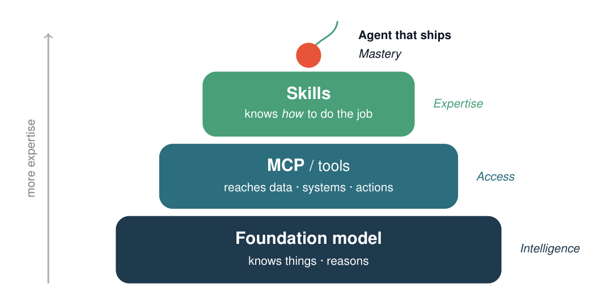

# Daytona Skill for Claude

A [Claude Agent Skill](https://platform.claude.com/docs/en/agents-and-tools/agent-skills/overview)
that teaches Claude to run code in Daytona sandboxes. It complements the Daytona MCP server: the
MCP connects Claude to Daytona; the Skill is the procedural layer that tells Claude how to use it
well — and how to reach the full SDK when the MCP's 12 tools aren't enough.



## Skill vs. MCP server

The MCP server is the connection: 12 stateless tools over the Daytona API. The Skill is the
know-how — when to create a sandbox, how to chain a build when `exec` is stateless, when to
snapshot, how to expose a preview, and to always clean up. Anthropic frames the two as layers,
not alternatives:

> If you're explaining how to do something, that's a skill. If you need Claude to access
> something, that's MCP.

The Skill drives the Daytona Python SDK — a superset of the MCP's tools (sessions, `code_run`,
snapshots, volumes, full git, lifecycle) — and adds ~100 tokens of context when idle, versus a
dozen tool schemas loaded into every conversation. Full comparison:
[`reference/sdk-vs-mcp.md`](skills/daytona-sandbox/reference/sdk-vs-mcp.md).

## Layout

```
.claude-plugin/marketplace.json   Plugin registry (publish this repo as a marketplace)
skills/daytona-sandbox/
  SKILL.md                        Entry point: lifecycle playbook + links
  reference/                      Loaded on demand (progressive disclosure)
    sandboxes.md, exec.md, files.md, preview.md, sdk-vs-mcp.md
  examples/                       run-python.md, clone-and-test.md
  scripts/                        Run via bash; code never enters context
    healthcheck.py                Verify DAYTONA_API_KEY + connectivity
    run_in_sandbox.py             Deterministic create → run → destroy helper
blog/                             "Skills vs MCPs" launch post + capability diagram
```

## Quick start

Set a Daytona API key (create one at https://app.daytona.io → API Keys) and install the SDK for
the bundled scripts:

```bash
export DAYTONA_API_KEY=...        # PowerShell: $env:DAYTONA_API_KEY = "..."
python -m pip install daytona
python skills/daytona-sandbox/scripts/healthcheck.py    # expect: READY
```

## Install

Claude Code, via the plugin marketplace:

```bash
/plugin marketplace add jiviny/daytona-skill
/plugin install daytona-sandbox@daytona-skills
```

Claude Code, local:

```bash
cp -r skills/daytona-sandbox ~/.claude/skills/      # personal (all projects)
cp -r skills/daytona-sandbox .claude/skills/        # or: this project only
```

Confirm with `/skills`, or invoke directly with `/daytona-sandbox`.

claude.ai and the API take the `skills/daytona-sandbox` folder directly (claude.ai: Settings →
Capabilities → Skills; API: the `/v1/skills` endpoints). Skills don't sync across surfaces —
install on each. The bundled scripts need a code-execution environment with network access;
Claude Code has it, the bare API surface does not (use the MCP server there).

## Launch post

`blog/skills-vs-mcps.tex` ([PDF](blog/skills-vs-mcps.pdf)) — a short post on why Skills and MCP
are different layers. The capability diagram is standalone in [`blog/diagram/`](blog/diagram/).

## License

Apache-2.0. See [`skills/daytona-sandbox/LICENSE.txt`](skills/daytona-sandbox/LICENSE.txt).
